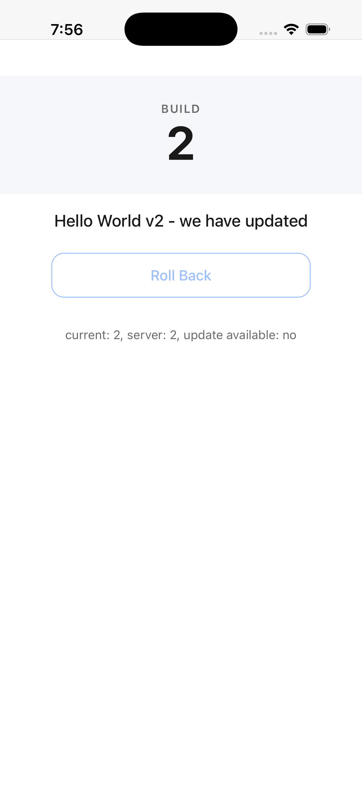

# Roll-Your-Own Ionic Live Updates POC

A throwaway proof-of-concept for shipping web-asset changes to a Capacitor iOS
app at runtime without going through the App Store — a simpler, self-hosted
alternative to Ionic AppFlow's Live Updates feature.

> ⚠️ **Insecure by design.** This is a POC only: plain HTTP, no payload signing,
> no integrity verification beyond an `index.html` presence check. **Do not ship
> this code to real users.** See the limitations section below and `PRD.md`.

## Status

The **server** workspace (`packages/server`) is implemented: a Fastify +
TypeScript app that serves `GET /api/updates/latest` from an on-disk
`manifest.json` and serves payload zips from `packages/server/payloads/`.
HTTP contract tests are in place.

The **app** workspace (`packages/app`) is scaffolded as an Ionic + Angular 22 +
Capacitor (iOS only) project. It ships a minimal Hello World UI that renders
the build number and greeting from a `version.ts` constant, plus a disabled
"Roll Back" button (no previous bundle to roll back to yet). The iOS platform
is added, `npx cap sync ios` succeeds, and the app launches in the iOS
simulator showing "Build: 1 / Hello World".

The inlined live-update plugin's **state + version-check** slice is implemented
(issue 04): a TypeScript API (`src/plugins/live-update/`) backed by a native
Swift `LiveUpdatePlugin` (`CAPPlugin` + `CAPBridgedPlugin`) shipped as a local
Capacitor plugin package (`packages/app/live-update-plugin/`, consumed via a
`file:` dependency — not a separate pnpm workspace package, per PRD user story
4). On cold launch the app calls `ensureStorage()` → `getState()` →
`checkForUpdate()` non-blocking, surfacing "current: N, server: M, update
available: yes/no" in the UI. The on-device layout `Library/Application
Support/liveupdates/{current,previous,state.json}` is created on first launch
and is inspectable via `xcrun simctl get_app_container`. The download/unzip
(06), atomic swap (07), and WebView reload (08) slices are now implemented:
the full update pipeline runs — `prepareUpdate` → `applyUpdate` → `reload` —
so publishing build N+1 on the server and foregrounding the app shows the
"Updating…" overlay followed by a reload displaying build N+1's greeting.
Rollback (09) is implemented: the "Roll Back" button flips `current/www/` and
`previous/www/` and reloads to the prior build. End-to-end error-path
hardening + DoD verification (10) is complete — every failure mode (corrupt
zip, missing-`index.html` zip, swap-move failure, `state.json`-write failure)
was verified on the iOS simulator to leave the active bundle running and
`state.json`/`current/` unchanged, and the full definition-of-done walkthrough
(launch build N → publish N+1 → foreground → update + reload → roll back →
reload to N) passes. See
[`docs/decisions/10-error-path-hardening.md`](docs/decisions/10-error-path-hardening.md).

The **foreground-resume trigger** slice is implemented (issue 05): on iOS the
app subscribes to `@capacitor/app`'s `appStateChange` event and, when the app
returns to the foreground (`isActive === true`), re-runs `checkForUpdate()`
silently — no overlay, no download (those arrive in 06–08). The result drives
a dedicated user-facing "Update available — build M" badge (`ion-badge`) that
appears only when `server.version > current`, and is hidden when equal/lower
or when a check fails. The cold-launch check reuses the same code path and
writes the verbose debug status line.

## Monorepo layout

```
.
├── PRD.md
├── README.md
├── package.json          # root (private), pnpm workspace tooling + dev scripts
├── pnpm-workspace.yaml   # declares packages/*
├── issues/               # slice-by-slice implementation plan
└── packages/
    ├── app/              # Ionic + Angular 22 + Capacitor (iOS only)
    │   ├── src/          #   version.ts + Hello World UI + plugins/live-update/ (TS API)
    │   ├── live-update-plugin/  # inlined native plugin (local SPM package, file: dep)
    │   ├── ios/          #   native Xcode project (iOS only, no Android)
    │   └── capacitor.config.ts
    └── server/          # Fastify + TypeScript manifest/payload server
        ├── src/          #   buildServer() + manifest reader + CLI entry
        ├── test/         #   Fastify `inject` contract tests
        ├── manifest.json #   seed manifest (version 1)
        └── payloads/     #   served at /payloads/*.zip (zips gitignored)
```

### The live-update plugin is inlined into the app package

Per an explicit decision in `PRD.md` (user story 4), the Capacitor live-update
plugin is **not** a standalone pnpm workspace package. It lives as a subfolder
inside `packages/app` — its TypeScript API (`src/plugins/live-update/`) sits
alongside the Angular source, and its native Swift code ships as a *local
Capacitor plugin package* at `packages/app/live-update-plugin/` (with its own
`Package.swift`), consumed by the app via a `file:` dependency. This is the
canonical way Capacitor's `cap sync` discovers and registers a local native
plugin class (it scans the package's Swift sources for `@objc(...)` and adds
the class to `packageClassList`, then links the SPM product into `CapApp-SPM`).

This keeps the plugin inlined within `packages/app` (no published package, no
separate workspace entry) while still using Capacitor's standard registration
path — the only deviation from the PRD's literal "under the iOS project"
wording, made necessary because Capacitor has no in-place registration hook for
arbitrary Swift files added directly to `CapApp-SPM`'s sources.

## Prerequisites

- [Node.js](https://nodejs.org/) >= 20
- [pnpm](https://pnpm.io/) >= 10
- Xcode (for the iOS simulator and the native plugin build)

## Getting started

```sh
pnpm install
```

Root convenience scripts orchestrate the workspaces:

```sh
pnpm dev:server   # start the Fastify manifest/payload server (plain HTTP, localhost:3000)
pnpm dev:app      # run the Ionic/Angular app in a browser (web dev only; no native plugin)
pnpm build        # build all workspaces
pnpm test         # run tests across all workspaces (server contract tests)
pnpm publish:payload  # build + zip the app and publish it to the server (manual publish workflow)
```

## Trying it out (manual testing on the iOS simulator)

This walkthrough exercises the full update + rollback flow end-to-end on the
iOS simulator. It mirrors the PRD's definition of done. All commands assume
you are at the repo root.

<p align="center">
  
</p>

*The app at its baseline (build 1), showing the build card, greeting, and the
disabled Roll Back button (no previous bundle yet).*

You will need a booted iOS simulator. Find its device id and set it as a
shell variable for the commands below:

```sh
xcrun simctl list devices booted   # copy the device id, e.g. 4A180F51-…
export DEV=<paste device id here>
```

### 1. One-time setup: build, sync, install, launch

```sh
pnpm install
pnpm --filter @ionic-update-poc/app build        # build the Angular app (build 1)
cd packages/app && npx cap sync ios && cd -      # copy www/ into the iOS project + register the plugin
xcodebuild -project packages/app/ios/App/App.xcodeproj -scheme App \
  -destination "platform=iOS Simulator,id=$DEV" -configuration Debug build
APP=$(find ~/Library/Developer/Xcode/DerivedData/App-*/Build/Products/Debug-iphonesimulator -name App.app -maxdepth 1)
xcrun simctl install $DEV "$APP"
xcrun simctl launch $DEV com.ionicupdatepoc.app
```

The app launches showing **Build: 1 / Hello World**, with the status line
reading `current: 1, server: 1, update available: no` (once the cold-launch
check completes) and the **Roll Back** button disabled (no previous bundle).

### 2. Start the server

In a separate terminal:

```sh
pnpm dev:server
```

It listens on `http://127.0.0.1:3000`, serving `GET /api/updates/latest`
from `packages/server/manifest.json` and payload zips from
`packages/server/payloads/`. Leave it running for the rest of the walkthrough.

### 3. Silent no-update check

With the server at build 1 and the app at build 1, background the app
(`Cmd+Shift+H` in the Simulator) and resume it (tap the app icon). The
foreground-resume check runs silently: **no overlay, no badge, no update**.
The status line should still read `update available: no`. This is the
non-blocking, silent check path (PRD user stories 33 & 14).

### 4. Publish build 2 and watch the app update (the core flow)

Edit `packages/app/src/version.ts`:

```ts
export const VERSION: number = 2;
export const GREETING: string = 'Hello World v2';
```

Then publish (builds Angular, zips `www/` to `packages/server/payloads/build-2.zip`
with `index.html` at the archive root, and rewrites `manifest.json` to v2):

```sh
pnpm publish:payload
```

The server picks up the rewritten manifest on the next request — no restart
needed. Now background → resume the app in the Simulator. You should see:

1. the **"Updating…"** overlay appear over the WebView,
2. the download / unzip / swap run (a second or two),
3. the WebView reload to **Build: 2 / Hello World v2**.

The cold-launch check (kill + relaunch the app) triggers the same pipeline if
you'd rather not background/resume.

### 5. Inspect the on-device state

```sh
CONTAINER=$(xcrun simctl get_app_container $DEV com.ionicupdatepoc.app data)
LU="$CONTAINER/Library/Application Support/liveupdates"
cat "$LU/state.json"                                  # { "current": 2, "previous": null }
find "$LU/current/www" -name 'main-*.js' \
  -exec grep -ohE 'Hello World v[0-9]' {} \;            # Hello World v2
```

`current/www/` holds the newly-downloaded bundle; `previous/` is empty
(there was no prior current to roll back from on the first update).

### 6. Publish build 3 and update again (creates a rollback target)

Edit `packages/app/src/version.ts` → `VERSION: 3`, `GREETING: 'Hello World v3'`,
then `pnpm publish:payload`. Background → resume the app → it updates to
**Build: 3 / Hello World v3**. Now `state.json` reads
`{ "current": 3, "previous": 2 }` and the **Roll Back button is enabled**
(a previous bundle now exists).

### 7. Roll back (read this carefully — ordering matters)

> ⚠️ **Lower the server before tapping Roll Back.** The app re-runs its update
> check on every cold launch and foreground-resume *and* immediately after a
> rollback reload. If the server is still offering a higher version when you
> roll back, the rolled-back bundle will see `server.version > local.version`,
> immediately re-download the newer build, and reload back to it — so the
> rollback appears to "not work" (it did work; it was just instantly undone).
>
> To make a rollback *stick*, drop the server to the version you are rolling
> back to **first**, then tap Roll Back.

Lower the server to build 2 (the zip already exists, so just rewrite the
manifest — no rebuild needed):

```sh
node -e '
  const fs = require("fs");
  const m = {
    version: 2,
    url: "http://localhost:3000/payloads/build-2.zip",
    createdAt: new Date().toISOString()
  };
  fs.writeFileSync("packages/server/manifest.json", JSON.stringify(m, null, 2) + "\n");
  console.log("manifest lowered to v2");
'
```

Now tap **Roll Back** in the app. It swaps `current`↔`previous`, reloads to
**Build: 2 / Hello World v2**, and build 2's check finds `server.version (2)`
is not greater than `local.current (2)` → **no re-update → it stays on build 2**.

Verify:

```sh
cat "$LU/state.json"   # { "current": 2, "previous": 3 }  (previous is now build 3)
```

The Roll Back button stays enabled (previous = build 3 still exists), so you
can roll forward again by tapping it once more (with the server still at v2,
rolling forward to build 3 would then see `2 < 3`... but the server is at v2,
so build 3's check finds no update and stays on build 3 — symmetric and safe).

> **Alternative:** if you don't want to touch the manifest, just stop the
> server (`Ctrl+C` in its terminal) before tapping Roll Back. Build 2's check
> will fail the network fetch, leave `updateAvailable` false, and the rolled-
> back bundle stays. Either approach works; the point is "the server must not
> be offering a higher version at the moment of rollback."

### 8. Error path: corrupt zip leaves the app running

The repo ships a corrupt payload at `packages/server/payloads/build-3-corrupt.zip`
(random bytes, no valid zip end-of-central-directory). Point the manifest at it
with a high version number so the app considers it an update:

```sh
node -e '
  const fs = require("fs");
  const m = {
    version: 99,
    url: "http://localhost:3000/payloads/build-3-corrupt.zip",
    createdAt: new Date().toISOString()
  };
  fs.writeFileSync("packages/server/manifest.json", JSON.stringify(m, null, 2) + "\n");
  console.log("manifest pointed at corrupt zip");
'
```

Background → resume the app. You'll see the "Updating…" overlay briefly,
then it is dismissed and the app **stays on its current build** with no
crash and no broken state. `state.json` and `current/www` are unchanged —
this is the PRD's "a failed update is equivalent to no update having been
attempted" guarantee (user story 40). There is also a
`build-3-noindex.zip` (valid zip, no `index.html`) you can point at to
exercise the other prepare-time failure mode.

### 9. Reset to a clean baseline

When you're done, restore the committed manifest + version and wipe the
on-device state so the repo is back to build 1:

```sh
xcrun simctl uninstall $DEV com.ionicupdatepoc.app   # wipes the data container (state.json, bundles)
git checkout packages/server/manifest.json packages/app/src/version.ts
pnpm --filter @ionic-update-poc/app build && (cd packages/app && npx cap sync ios)
# reinstall + relaunch as in step 1 if you want to start again
```

### How the rollback ordering maps to the design

The auto-re-update-after-rollback behaviour is a deliberate consequence of
the POC's design (not a bug): the update check fires on every cold launch and
foreground-resume and auto-applies any available update (PRD user stories 12,
13, and the update flow in "Implementation Decisions"). A rollback is only
"sticky" when the server is no longer offering a newer build at the moment
the rolled-back bundle runs its post-reload check. A production
implementation wanting a rollback that sticks regardless of the server would
need an explicit "suppress auto-update for one cycle after a manual rollback"
flag — that is out of scope for this POC.

## Decision notes

- [`docs/decisions/08-reload-webview-9a.md`](docs/decisions/08-reload-webview-9a.md)
  — the WebView is reloaded from the new bundle using Capacitor's
  `CAPBridgeProtocol.setServerBasePath(_:)` (PRD approach 9a). The fallback
  runtime-module-swap (9b) is **not** implemented because 9a is feasible
  with a ~10-line native method and no `CAPBridge` subclassing.
- [`docs/decisions/10-error-path-hardening.md`](docs/decisions/10-error-path-hardening.md)
  — the four PRD failure modes (corrupt zip, missing-`index.html` zip,
  swap-move failure, `state.json`-write failure) were verified on the iOS
  simulator to leave the active bundle running and `state.json`/`current/`
  unchanged. The two internal failure modes (swap-move, state-write) are
  exercised via debug-only, env-gated fault injection (`LIVEUPDATE_FAULT`);
  the DoD walkthrough's rollback step is driven via a debug-only
  `LIVEUPDATE_AUTO_ROLLBACK` hook. Both hooks are no-ops in a normal app
  run. The full definition-of-done walkthrough (launch build N → publish N+1
  → foreground → update + reload → roll back → reload to N) passes.

## Verified error-path behaviour (issue 10)

Every failure mode during the update process was verified on the iOS
simulator to leave the **active bundle running** and `state.json` /
`current/www/` **unchanged** — a failed update is equivalent to no update
having been attempted (PRD user story 40):

| Failure mode | Trigger | Result on failure |
| --- | --- | --- |
| Corrupt / incomplete zip | `payloads/build-3-corrupt.zip` (random bytes, no EOCD) | `prepareUpdate` rejects after `unzip` throws; `staging/` + temp zip cleaned; overlay dismissed |
| Zip missing `index.html` | `payloads/build-3-noindex.zip` (valid zip, only `readme.txt`) | `prepareUpdate` rejects after the `index.html` guard; `staging/` cleaned; overlay dismissed |
| Directory-move failure | `LIVEUPDATE_FAULT=swap` (debug injection) | `applyUpdate` restores the temp backup into `current/`; new bundle left in `staging/`; state untouched |
| `state.json`-write failure | `LIVEUPDATE_FAULT=stateWrite` (debug injection) | `applyUpdate` restores directories (current→staging, previous→current); state never written |

In all four cases the app continued showing the previously active bundle.
See `docs/decisions/10-error-path-hardening.md` for the full verification
record and the screenshot set under `screenshots/issue10-phase*`.

## Definition of done (POC)

Open the app in the iOS simulator showing "Build: N / Hello World"; publish
build N+1 on the server; bring the app to the foreground; observe the
"Updating…" overlay, the download/swap, and the reload showing
"Build: N+1 / Hello World v2"; tap "Roll Back" and observe the app reload
showing "Build: N" again. A failed update (e.g. a corrupt zip) must leave
build N running.

> **Rollback caveat:** for the rollback step to *stay* on build N, the server
> must no longer be offering build N+1 when you tap Roll Back — otherwise the
> rolled-back bundle re-detects the newer build and immediately re-updates.
> See step 7 of the [Trying it out](#trying-it-out-manual-testing-on-the-ios-simulator)
> walkthrough above. This is a deliberate consequence of the auto-update-on-
> check design, not a bug.

A step-by-step walkthrough of the full DoD (including the rollback ordering)
lives in the [Trying it out](#trying-it-out-manual-testing-on-the-ios-simulator)
section above. See `PRD.md` for the full problem statement, solution, user
stories, and implementation decisions.
