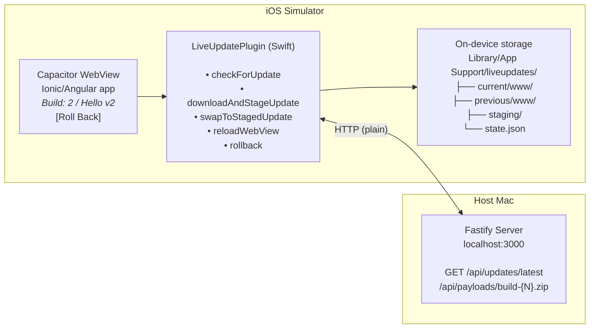

# Roll-Your-Own Ionic Live Updates POC

A throwaway proof-of-concept that demonstrates shipping web-asset changes to a
Capacitor iOS app at runtime — without going through the App Store. It's a
simpler, self-hosted alternative to Ionic AppFlow's Live Updates feature.

> ⚠️ **Insecure by design.** This is a POC only: plain HTTP, no payload signing,
> no integrity verification beyond an `index.html` presence check. **Do not ship
> this code to real users.** See [Limitations](#limitations) below.

## What it does

1. An Ionic/Angular/Capacitor iOS app ships with a "Hello World" UI showing a
   build number and greeting.
2. A local Fastify server serves a manifest (`GET /api/updates/latest`) and
   static zip payloads.
3. When the app launches or returns to the foreground, an inlined Capacitor
   plugin checks the server for a newer build.
4. If a newer build exists, the plugin downloads the zip, unzips it, validates
   it, atomically swaps it into the active bundle slot, and reloads the WebView.
5. The user can tap "Roll Back" to revert to the previous bundle.
6. Every failure mode (corrupt zip, missing `index.html`, directory move error,
   state write error) leaves the currently running bundle untouched.

## Architecture



**Key design decisions (see `PRD.md` for full rationale):**

- **Two-slot storage** (`current/` + `previous/`) so a broken payload never
  bricks the app and rollback always has a target.
- **Atomic swap with temp directory** — `current/` is moved to `.swap_tmp`
  before any destructive operation; on failure it's restored.
- **`setServerBasePath`** (approach 9a) — Capacitor's sanctioned API for
  redirecting the internal web server to serve from a writable directory.
  `loadFileURL` was attempted first but failed because Capacitor's navigation
  delegate intercepts `file://` URLs.
- **Plugin inlined in the app package** — not a standalone Capacitor plugin
  package, to avoid packaging overhead for a throwaway POC.

## Prerequisites

| Tool | Minimum version | Check with |
|---|---|---|
| [Node.js](https://nodejs.org/) | 20 | `node --version` |
| [pnpm](https://pnpm.io/) | 10 | `pnpm --version` |
| [Xcode](https://developer.apple.com/xcode/) | 16+ (includes iOS 26 simulator) | `xcodebuild -version` |
| `zip` (CLI) | any | `zip --version` |

## Setup

### 1. Clone and install

```sh
git clone <repo-url> ionic-update-poc
cd ionic-update-poc
pnpm install
```

### 2. Configure the server URL for the iOS simulator

**This is the most important step.** iOS 26+ simulators run in their own
network namespace — `localhost` on the simulator does **not** reach
`localhost` on your Mac. You must use your Mac's LAN IP address.

Find your Mac's LAN IP:

```sh
ipconfig getifaddr en0   # Wi-Fi
# or
ipconfig getifaddr en1   # Ethernet
```

Then update **both** environment files with that IP:

- `packages/app/src/environments/environment.ts` (dev)
- `packages/app/src/environments/environment.prod.ts` (production)

```ts
export const environment = {
  production: false,
  serverUrl: 'http://192.168.1.100:3000',  // ← your Mac's LAN IP
};
```

### 3. Build and sync the iOS project

```sh
cd packages/app
pnpm cap:sync
```

This runs `cap sync` and then patches `capacitor.config.json` to register the
inlined `LiveUpdatePlugin` (since `cap sync` only scans `node_modules` for
plugins, it misses the inlined Swift code).

### 4. Open in Xcode and run on simulator

```sh
pnpm cap:open:ios
```

In Xcode:
- Select an **iOS 26 simulator** (e.g. iPhone 16 Pro)
- Press **▶ Run** (or `Cmd+R`)

The app will launch showing "Build: 1 / Hello World".

### 5. Start the update server

In a separate terminal:

```sh
pnpm dev:server
```

You should see:

```
Server running at http://localhost:3000
```

Verify it's reachable:

```sh
curl http://localhost:3000/api/updates/latest
# → {"version":1,"url":"http://localhost:3000/api/payloads/build-1.zip","createdAt":"..."}
```

## End-to-end walkthrough

This is the definition of done — follow these steps to verify the POC works.

### Step 1: Confirm the app shows Build 1

The iOS simulator should display:

```
Build: 1
Hello World
Local: 1   Server: 1   ✗ Up to date
[Roll Back] (disabled)
```

### Step 2: Publish Build 2

1. Edit `packages/app/src/app/version.ts`:

   ```ts
   export const BUILD = {
     number: 2,
     greeting: 'Hello World v2',
   } as const;
   ```

2. Run the publish script:

   ```sh
   pnpm publish:payload
   ```

   This builds the Angular app, zips the output, copies it to
   `packages/server/payloads/build-2.zip`, and updates `manifest.json`.

   > If your server isn't on `localhost:3000`, set `SERVER_URL`:
   > ```sh
   > SERVER_URL=http://192.168.1.100:3000 pnpm publish:payload
   > ```

3. Restart the server if it's already running (`Ctrl+C` then `pnpm dev:server`).

### Step 3: Trigger the update

Bring the iOS simulator app to the foreground (switch away and back, or press
the home button and re-open). You should see:

1. **"Checking for updates…"** briefly
2. **"Updating…" overlay** with a spinner
3. The overlay disappears and the app reloads showing:

   ```
   Build: 2
   Hello World v2
   Local: 2   Server: 2   ✗ Up to date
   [Roll Back] (enabled)
   ```

### Step 4: Roll back

Tap **Roll Back**. The app should reload showing:

```
Build: 1
Hello World
Local: 1   Server: 2   ✓ Update available
[Roll Back] (disabled)
```

The app detects Build 2 is still available on the server, but won't
auto-update again until you bring it to the foreground.

### Step 5: Test error resilience (optional)

To verify a corrupt zip doesn't brick the app:

```sh
# Create a deliberately broken zip
echo "not a zip file" > packages/server/payloads/build-3.zip
echo '{"version":3,"url":"http://localhost:3000/api/payloads/build-3.zip","createdAt":"2026-01-01T00:00:00Z"}' > packages/server/manifest.json
```

Restart the server, bring the app to the foreground. The app should show the
"Updating…" overlay briefly, then dismiss it and **keep running Build 1**
(or whatever the current bundle is). The active bundle is never touched.

## Running tests

```sh
# All tests (server + app)
pnpm test

# Server tests only (Fastify HTTP contract)
pnpm --filter @ionic-update-poc/server test

# App tests only (Angular unit tests)
pnpm --filter @ionic-update-poc/app test
```

The server test suite covers:
- Manifest shape validation (`version`, `url`, `createdAt`)
- On-disk manifest reflection
- Manifest rewrite simulation (publish)
- Static payload serving with correct content type
- 404 for non-existent payloads

## Project structure

```
.
├── PRD.md                    # Full product requirements
├── README.md                 # This file
├── package.json              # Root workspace scripts
├── pnpm-workspace.yaml       # Declares packages/*
├── scripts/
│   └── publish.mjs           # Semi-automated payload publish
├── issues/                   # Slice-by-slice implementation plan
└── packages/
    ├── app/                  # Ionic + Angular + Capacitor (iOS only)
    │   ├── scripts/
    │   │   └── patch-capacitor-config.mjs  # Registers inlined plugin
    │   ├── src/
    │   │   ├── app/
    │   │   │   ├── version.ts              # Build number + greeting
    │   │   │   ├── home/                   # Main UI page
    │   │   │   └── live-update/            # Plugin TS API + service
    │   │   │       ├── plugin.ts           # Capacitor plugin registration
    │   │   │       ├── types.ts            # TypeScript interfaces
    │   │   │       ├── update.service.ts   # Angular service wrapper
    │   │   │       └── index.ts            # Barrel export
    │   │   └── environments/              # Server URL config
    │   └── ios/App/App/
    │       ├── LiveUpdatePlugin.swift      # Native plugin implementation
    │       └── AppDelegate.swift           # Standard Capacitor delegate
    └── server/               # Fastify + TypeScript
        ├── src/
        │   ├── index.ts                    # Entry point
        │   ├── server.ts                   # Fastify app + routes
        │   ├── manifest.ts                 # Manifest file reader
        │   └── types.ts                    # Manifest interface
        ├── test/
        │   └── server.test.ts              # HTTP contract tests
        ├── manifest.json                   # Current version on disk
        └── payloads/                      # Static zip payloads
```

## Error-path hardening

Every failure mode during the update process leaves the active bundle pointer
untouched and the app running the previously active bundle.

| Failure mode | Active bundle behaviour | `state.json` / `current/` |
|---|---|---|
| Corrupt or incomplete zip download | App keeps running the current bundle. Temp file discarded | Unchanged — `downloadAndStageUpdate` never touches `current/` or `state.json` |
| Zip unzips but is missing `index.html` | App keeps running the current bundle. Staging cleaned up | Unchanged — validation rejects before swap |
| Failure during directory move | Old `current/` restored from `.swap_tmp` | `state.json` preserved by `.atomic` write; directories restored |
| Failure during `state.json` write | Directories restored from `.swap_tmp` | `.atomic` write preserves original file |
| Rollback failure mid-swap | Old `current/` restored from `.rollback_tmp` | `state.json` preserved; directories restored |
| Rollback with no previous bundle | Nothing happens — button is disabled | Unchanged |

### Design principles

- **Staging isolation** — download/unzip happens entirely in `staging/`.
  `current/`, `previous/`, and `state.json` are untouched until validation passes.
- **Atomic swap** — `current/` is moved to `.swap_tmp` before any destructive
  operation. On failure, it's moved back.
- **Atomic writes** — `state.json` uses `Data.write(to:options: .atomic)`
  (write-to-temp-then-rename), so a failure leaves the original intact.
- **Rollback mirroring** — rollback uses the same `.rollback_tmp` pattern.

## WebView reload mechanism

The POC uses Capacitor's `setServerBasePath(path:)` API (approach 9a) to
redirect the internal web server to serve from the writable `current/www/`
directory, then calls `webView.reload()`.

`WKWebView.loadFileURL(_:allowingReadAccessTo:)` was attempted first but
failed — Capacitor's `WKNavigationDelegate` intercepts `file://` navigations
and tries to open them externally in Safari, causing a sandbox error.

## Limitations

This is a throwaway POC. The following are **explicitly out of scope**:

- Payload signing, integrity hashing, or cryptographic verification
- HTTPS / TLS on the local server
- Automatic crash-detection rollback (heartbeat/watchdog)
- Android platform
- Real device testing (iOS simulator only)
- CI/CD pipeline for payload generation
- Standalone Capacitor plugin package
- Updating native code (Swift/Obj-C) via live update
- Persistent error/telemetry reporting
- Multi-platform or per-bundle granularity in versioning

A production implementation would need HTTPS, a signed manifest (server signs
`{ version, url, sha256 }` with a private key; public key bundled in the app;
plugin verifies signature and zip SHA-256 before unpacking), and a crash
heartbeat for automatic rollback.

## Troubleshooting

### "Checking for updates…" shows Server: (unreachable)

The iOS simulator can't reach your Mac. Check:

1. Your Mac's LAN IP is correct in both `environment.ts` and
   `environment.prod.ts`.
2. The server is running (`pnpm dev:server`).
3. Your Mac's firewall isn't blocking port 3000:
   ```sh
   sudo /usr/libexec/ApplicationFirewall/socketfilterfw --listapps
   ```
4. Try `curl http://<YOUR_IP>:3000/api/updates/latest` from your Mac to
   confirm the server is reachable on the LAN interface.

### "Updating…" overlay appears but app doesn't update

Check the Xcode console for `[LiveUpdate]` log messages. Common causes:

- **Zip contains compressed entries** — the POC unzipper only handles stored
  (uncompressed) entries. The publish script uses `zip -0` for this reason.
  If you zip manually, use `zip -0`.
- **Zip is missing `index.html`** — the Angular build output must contain
  `index.html` at the root of the zip.
- **Manifest URL doesn't match** — the `url` in `manifest.json` must be
  reachable from the simulator (use the LAN IP, not `localhost`).

### Build errors in Xcode

If you see `Cannot find 'LiveUpdatePlugin' in scope` or similar:

```sh
cd packages/app
pnpm cap:sync
```

This re-runs `cap sync` and the post-sync patch that registers the inlined
plugin in `capacitor.config.json`.

### "No such module 'Capacitor'" in Xcode

The Capacitor Swift package may not have resolved. In Xcode:

1. **File → Packages → Resolve Package Versions**
2. Clean the build (**Product → Clean Build Folder** or `Cmd+Shift+K`)
3. Build again

### Port 3000 already in use

```sh
PORT=3001 pnpm dev:server
```

Then update `serverUrl` in both environment files to match.
